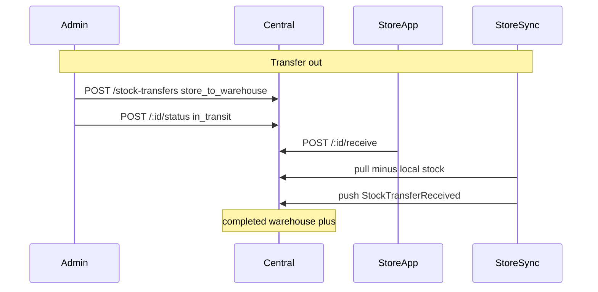

# Stock transfers (warehouse ↔ store)

Central API support for **bidirectional** stock transfers. Transfers are **created only on central** (admin / warehouse UI); stores confirm quantities and store sync applies local billing stock.

| Direction | `direction` value | Movement |
|-----------|-------------------|----------|
| **Transfer in** | `warehouse_to_store` (default) | Warehouse → store |
| **Transfer out** | `store_to_warehouse` | Store → warehouse |

This repo does not include the admin web UI; an external front end should call these endpoints.

## Relation to purchase intents

**Transfer in only.** A store purchase intent leads to a warehouse transfer:

`POST /stock-transfers/from-purchase-intent/:intentId`

- Copies `toStoreId` from the intent and builds **lines** from `intent.lines`.
- Optional `lineOverrides` per SKU.
- Rejected if the intent is `rejected`, `cancelled`, or `fulfilled`.

## Auto transfer from GRN

**Transfer in only.** Create a transfer from a **posted** goods receipt and advance it directly to **`awaiting_intake`** in one call:

`POST /stock-transfers/from-grn/:grnId`

Prerequisites:

- GRN must already be posted (`POST /goods-receipts/:id/post`).
- Caller supplies `toStoreId` in the request body.

Request body:

```json
{
  "toStoreId": "store-01",
  "locationId": "<optional warehouse Location ObjectId>",
  "stockClassification": "Normal Stock",
  "receivedBy": "Warehouse Admin",
  "remarks": "Auto from GRN-000032",
  "lineOverrides": [{ "sku": "SKU-001", "qty": 3 }]
}
```

Behavior:

- Builds transfer **lines** from GRN valid rows (`outcome === 'valid'`); uses `receivedQty` unless overridden.
- Skips warehouse stock checks (GRN already posted stock to warehouse).
- Auto-advances: `draft` → `in_transit` → `awaiting_intake` (ledger movements same as manual dispatch + receive).
- Sets `goodsReceiptId` on the transfer for traceability.
- Creates a row in **`grn_auto_transfer_histories`** for audit and duplicate prevention.
- Store POS completes intake via existing sync (`StockTransferReceived` → `completed`); history status updates to `completed`.

Rejected if GRN is not `posted`, has no valid lines, `toStoreId` is unknown, or auto transfer already exists for that GRN (see below).

### GRN auto-transfer history (`grn_auto_transfer_histories`)

Each successful `from-grn` call records:

| Field | Description |
|-------|-------------|
| `goodsReceiptId` | Source GRN |
| `stockTransferId` | Linked transfer |
| `transferNo`, `grnLabel`, `toStoreId` | Denormalized for errors/UI |
| `status` | `awaiting_intake`, `completed`, or `cancelled` |
| `completedAt` / `cancelledAt` | Set when the linked transfer reaches that state |

**Duplicate restriction (one active auto transfer per GRN):**

| Existing history status | New `from-grn` for same GRN |
|-------------------------|----------------------------|
| `awaiting_intake` | **400** — already in progress |
| `completed` | **400** — already completed |
| `cancelled` | Allowed — new attempt creates a new history row |
| No row | Allowed |

Example error when already completed:

```json
{
  "statusCode": 400,
  "message": "Auto transfer already completed for GRN GRN-000032. Transfer TR-1042 was sent to store store-001.",
  "error": "Bad Request"
}
```

Example error when still awaiting store intake:

```json
{
  "statusCode": 400,
  "message": "Auto transfer already in progress for GRN GRN-000032. Transfer TR-1042 is awaiting store intake at store-001.",
  "error": "Bad Request"
}
```

A partial unique index on `goodsReceiptId` (for `awaiting_intake` and `completed` rows) prevents concurrent duplicate inserts.

## Data model (collection `stock_transfers`)

| Field | Description |
|--------|-------------|
| `transferNo` | Human-readable id, e.g. `TR-1234` |
| `direction` | `warehouse_to_store` or `store_to_warehouse` (legacy rows without field = in) |
| `fromKind` | `warehouse` (in) or `store` (out) |
| `fromLocationId` | Source warehouse location (transfer in) |
| `fromStoreId` | Source store (transfer out) |
| `toStoreId` | Destination store (transfer in) |
| `toLocationId` | Destination warehouse location (transfer out, optional) |
| `purchaseIntentId` | Set when created from an intent (in only) |
| `goodsReceiptId` | Set when created from a posted GRN (in only) |
| `status` | See lifecycle below |
| `transferDate`, `remarks`, `stockClassification` | Optional |
| `receivedAt`, `receivedBy` | Store confirmation metadata |
| `lines[]` | `sku`, optional `description`, `qty` |

## Status lifecycle

Same status machine for **in** and **out**:

| Status | Set by | Mechanism |
|--------|--------|-----------|
| `draft` | Admin | `POST /stock-transfers` or `PATCH` |
| `in_transit` | Admin | `POST /stock-transfers/:id/status` |
| `awaiting_intake` | Store | `POST /stock-transfers/:id/receive` (full line match) |
| `completed` | Store sync | `StockTransferReceived` push |
| `cancelled` | Admin | `POST /:id/status` from `draft` or `in_transit` |

`in_transit` → `awaiting_intake` only via **receive**, not via status.

### Transfer in (warehouse → store)

1. Admin creates → `draft`.
2. Admin dispatch → `in_transit` (warehouse −, in_transit +).
3. Store receive → `awaiting_intake`.
4. Store sync → `completed` (in_transit −, store +; local `stockQty` **increases**).

### Transfer out (store → warehouse)

1. Admin creates with `direction: store_to_warehouse`, `fromStoreId` → `draft`.
2. Admin dispatch → `in_transit` (store − on central ledger, in_transit +). Fails if central store stock insufficient.
3. Store confirms dispatch qty → `awaiting_intake` (`storeId` = `fromStoreId`).
4. Store sync → `completed` (in_transit −, warehouse +; local `stockQty` **decreases**, clamped at 0).



## HTTP API summary

| Method | Path | Purpose |
|--------|------|---------|
| `POST` | `/stock-transfers` | Create in or out (see examples) |
| `POST` | `/stock-transfers/from-purchase-intent/:intentId` | Draft **in** from purchase intent |
| `POST` | `/stock-transfers/from-grn/:grnId` | **In** from posted GRN → `awaiting_intake` |
| `GET` | `/stock-transfers` | List; query: `direction`, `toStoreId`, `fromStoreId`, `status`, `purchaseIntentId`, `search` |
| `GET` | `/stock-transfers/:id` | Detail |
| `PATCH` | `/stock-transfers/:id` | Update **draft** only |
| `POST` | `/stock-transfers/:id/status` | Admin status change |
| `POST` | `/stock-transfers/:id/receive` | Store confirm qty → `awaiting_intake` |

### Example: transfer in create

```json
POST /stock-transfers
{
  "direction": "warehouse_to_store",
  "toStoreId": "store-01",
  "lines": [{ "sku": "SKU-001", "qty": 5 }]
}
```

### Example: transfer out create

```json
POST /stock-transfers
{
  "direction": "store_to_warehouse",
  "fromStoreId": "store-01",
  "lines": [{ "sku": "SKU-001", "qty": 3 }],
  "remarks": "Return to warehouse"
}
```

### Example: store receive

**Transfer in** — `storeId` must match `toStoreId`:

```http
GET /stock-transfers?direction=warehouse_to_store&toStoreId=store-01&status=in_transit
```

**Transfer out** — `storeId` must match `fromStoreId`:

```http
GET /stock-transfers?direction=store_to_warehouse&fromStoreId=store-01&status=in_transit
```

```json
POST /stock-transfers/:id/receive
{
  "storeId": "store-01",
  "receivedBy": "Ravi",
  "lines": [{ "sku": "SKU-001", "qty": 3 }]
}
```

Quantity mismatch returns **400** (`Receipt quantity mismatch for sku …`); status stays `in_transit`.

### Store sync

See [sync-protocol.md](./sync-protocol.md). Pull payloads include `direction` and `fromStoreId` when applicable.

## Inventory

See [inventory.md](./inventory.md). Summary:

- **In:** dispatch reduces warehouse; complete increases store (central) and local store stock.
- **Out:** dispatch reduces store (central); complete increases warehouse; store sync **subtracts** local stock on pull.

## Store sales availability

Store billing uses `local_products_cache.stockQty`. Transfer **in** adds; transfer **out** subtracts (never below zero). Low stock triggers `PurchaseIntentCreated` for replenishment (transfer in from warehouse).
